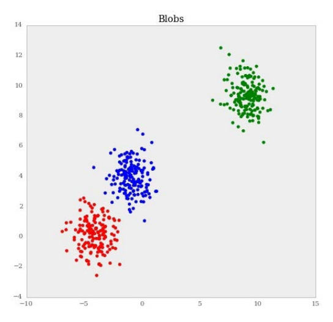

# 第三章 使用距离向量构建模型

## 3.1 使用 KMeans 对数据聚类

聚类是个非常实用的技巧。通常，我们在采取行动时需要分治。考虑公司的潜在客户列表。公司可能需要将客户按类型分组，之后为这些分组划分职责。聚类可以使这个过程变得容易。

KMeans 可能是最知名的聚类算法之一，并且也是最知名的无监督学习技巧之一。

### 准备

首先，让我们看一个非常简单的聚类，之后我们再讨论 KMeans 如何工作。

```py
>>> from sklearn.datasets import make_blobs 
>>> blobs, classes = make_blobs(500, centers=3)
```

同样，由于我们绘制一些图表，导入`matplotlib`，像这样：

```py
>>> import matplotlib.pyplot as plt
```

### 操作步骤

我们打算浏览一个简单的例子，它对伪造数据进行聚类。之后我们会稍微谈论一下，KMeans 如何工作，来寻找最优的块数量。

看一看我们的数据块，我们可以看到，有三个不同的簇。

```
>>> f, ax = plt.subplots(figsize=(7.5, 7.5)) 
>>> ax.scatter(blobs[:, 0], blobs[:, 1], color=rgb[classes]) 
>>> rgb = np.array(['r', 'g', 'b']) 
>>> ax.set_title("Blobs")
```

输出如下：



现在我们可以使用 KMeans 来寻找这些簇的形心。第一个例子中，我们假装知道有三个形心。

```
>>> from sklearn.cluster import KMeans 
>>> kmean = KMeans(n_clusters=3) 
>>> kmean.fit(blobs) 
KMeans(copy_x=True, init='k-means++', max_iter=300, n_clusters=3,
       n_init=10, n_jobs=1, precompute_distances=True,
       random_state=None, tol=0.0001, verbose=0)

>>> kmean.cluster_centers_ array([[ 0.47819567,  1.80819197],

[ 0.08627847,  8.24102715], 
[ 5.2026125 ,  7.86881767]])

>>> f, ax = plt.subplots(figsize=(7.5, 7.5)) 
>>> ax.scatter(blobs[:, 0], blobs[:, 1], color=rgb[classes]) 
>>> ax.scatter(kmean.cluster_centers_[:, 0],
               kmean.cluster_centers_[:, 1], marker='*', s=250,
               color='black', label='Centers')
>>> ax.set_title("Blobs") 
>>> ax.legend(loc='best')
```

下面的截图展示了输出：


其它属性也很实用。例如，`labels_`属性会产生每个点的预期标签。

```py
>>> kmean.labels_[:5] 
array([1, 1, 2, 2, 1], dtype=int32) 
```

我们可以检查，例如，`labels_`是否和类别相同，但是由于 KMeans 不知道类别是什么，它不能给两个类别分配相同的索引值：

```
>>> classes[:5] 
array([0, 0, 2, 2, 0])
```

将类别中的`1`变成`0`来查看是否与`labels_`匹配。

`transform`函数十分有用，它会输出每个点到形心的距离。

```py
>>> kmean.transform(blobs)[:5] 
array([[ 6.47297373,  1.39043536,  6.4936008 ],
       [ 6.78947843,  1.51914705,  3.67659072],
       [ 7.24414567,  5.42840092,  0.76940367],
       [ 8.56306214,  5.78156881,  0.89062961],
       [ 7.32149254,  0.89737788,  5.12246797]])

```

### 工作原理

KMeans 实际上是个非常简单的算法，它使簇中的点到均值的距离的平方和最小。

首先它会设置一个预定义的簇数量`K`，之后执行这些事情：

+   将每个数据点分配到最近的簇中。
+   通过计算初中每个数据点的均值，更新每个形心。

直到满足特定条件。
