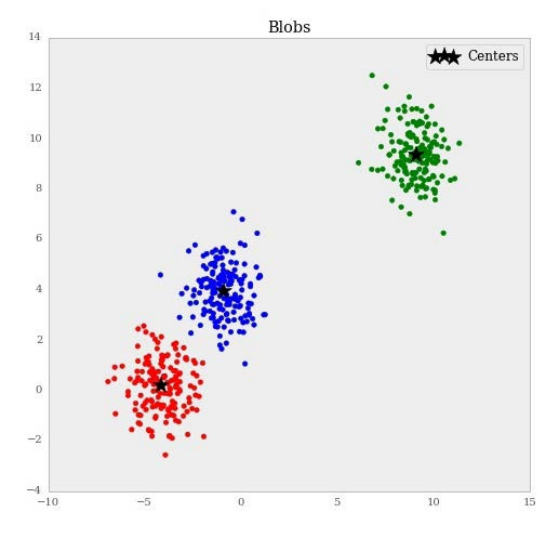
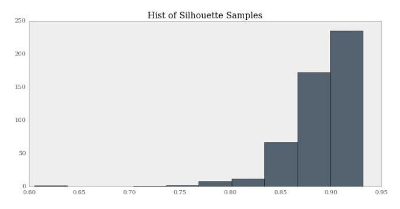
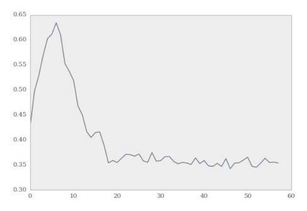
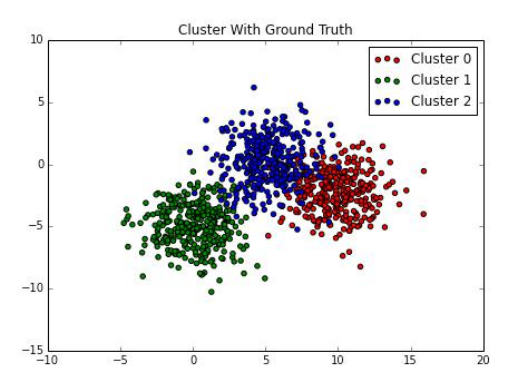
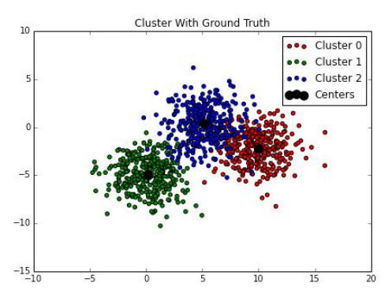
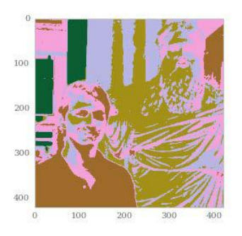

# 第三章 使用距离向量构建模型

## 3.1 使用 KMeans 对数据聚类

聚类是个非常实用的技巧。通常，我们在采取行动时需要分治。考虑公司的潜在客户列表。公司可能需要将客户按类型分组，之后为这些分组划分职责。聚类可以使这个过程变得容易。

KMeans 可能是最知名的聚类算法之一，并且也是最知名的无监督学习技巧之一。

### 准备

首先，让我们看一个非常简单的聚类，之后我们再讨论 KMeans 如何工作。

```py
>>> from sklearn.datasets import make_blobs 
>>> blobs, classes = make_blobs(500, centers=3)
```

同样，由于我们绘制一些图表，导入`matplotlib`，像这样：

```py
>>> import matplotlib.pyplot as plt
```

### 操作步骤

我们打算浏览一个简单的例子，它对伪造数据进行聚类。之后我们会稍微谈论一下，KMeans 如何工作，来寻找最优的块数量。

看一看我们的数据块，我们可以看到，有三个不同的簇。

```
>>> f, ax = plt.subplots(figsize=(7.5, 7.5)) 
>>> ax.scatter(blobs[:, 0], blobs[:, 1], color=rgb[classes]) 
>>> rgb = np.array(['r', 'g', 'b']) 
>>> ax.set_title("Blobs")
```

输出如下：


现在我们可以使用 KMeans 来寻找这些簇的形心。第一个例子中，我们假装知道有三个形心。

```
>>> from sklearn.cluster import KMeans 
>>> kmean = KMeans(n_clusters=3) 
>>> kmean.fit(blobs) 
KMeans(copy_x=True, init='k-means++', max_iter=300, n_clusters=3,
       n_init=10, n_jobs=1, precompute_distances=True,
       random_state=None, tol=0.0001, verbose=0)

>>> kmean.cluster_centers_ array([[ 0.47819567,  1.80819197],

[ 0.08627847,  8.24102715], 
[ 5.2026125 ,  7.86881767]])

>>> f, ax = plt.subplots(figsize=(7.5, 7.5)) 
>>> ax.scatter(blobs[:, 0], blobs[:, 1], color=rgb[classes]) 
>>> ax.scatter(kmean.cluster_centers_[:, 0],
               kmean.cluster_centers_[:, 1], marker='*', s=250,
               color='black', label='Centers')
>>> ax.set_title("Blobs") 
>>> ax.legend(loc='best')
```

下面的截图展示了输出：



其它属性也很实用。例如，`labels_`属性会产生每个点的预期标签。

```py
>>> kmean.labels_[:5] 
array([1, 1, 2, 2, 1], dtype=int32) 
```

我们可以检查，例如，`labels_`是否和类别相同，但是由于 KMeans 不知道类别是什么，它不能给两个类别分配相同的索引值：

```
>>> classes[:5] 
array([0, 0, 2, 2, 0])
```

将类别中的`1`变成`0`来查看是否与`labels_`匹配。

`transform`函数十分有用，它会输出每个点到形心的距离。

```py
>>> kmean.transform(blobs)[:5] 
array([[ 6.47297373,  1.39043536,  6.4936008 ],
       [ 6.78947843,  1.51914705,  3.67659072],
       [ 7.24414567,  5.42840092,  0.76940367],
       [ 8.56306214,  5.78156881,  0.89062961],
       [ 7.32149254,  0.89737788,  5.12246797]])

```

### 工作原理

KMeans 实际上是个非常简单的算法，它使簇中的点到均值的距离的平方和最小。

首先它会设置一个预定义的簇数量`K`，之后执行这些事情：

+   将每个数据点分配到最近的簇中。
+   通过计算初中每个数据点的均值，更新每个形心。

直到满足特定条件。

## 3.2 优化形心数量

形心难以解释，并且也难以判断是否数量正确。理解你的数据是否是未分类的十分重要，因为这会直接影响我们可用的评估手段。

### 准备

为无监督学习评估模型表现是个挑战。所以，在了解真实情况的时候，`sklearn`拥有多种方式来评估聚类，但在不了解时就很少。

我们会以一个简单的簇模型开始，并评估它的相似性。这更多是出于机制的目的，因为测量一个簇的相似性在寻找簇数量的真实情况时显然没有用。

### 操作步骤

为了开始，我们会创建多个数据块，它们可用于模拟数据簇。

```py
>>> from sklearn.datasets import make_blobs 
>>> import numpy as np 
>>> blobs, classes = make_blobs(500, centers=3)

>>> from sklearn.cluster import KMeans 
>>> kmean = KMeans(n_clusters=3) 
>>> kmean.fit(blobs) 
KMeans(copy_x=True, init='k-means++', max_iter=300, n_clusters=3,
       n_init=10, n_jobs=1, precompute_distances=True,
       random_state=None, tol=0.0001, verbose=0) 
```

首先，我们查看轮廓（Silhouette）距离。轮廓距离是簇内不相似性、最近的簇间不相似性、以及这两个值最大值的比值。它可以看做簇间分离程度的度量。

让我们看一看数据点到形心的距离分布，理解轮廓距离非常有用。

```py
>>> from sklearn import metrics 
>>> silhouette_samples = metrics.silhouette_samples(blobs,
                         kmean.labels_) 
>>> np.column_stack((classes[:5], silhouette_samples[:5]))

array([[ 1.,  0.87617292],
       [ 1.,  0.89082363],
       [ 1.,  0.88544994],
       [ 1.,  0.91478369],
       [ 1.,  0.91308287]]) 
>>> f, ax = plt.subplots(figsize=(10, 5))

>>> ax.set_title("Hist of Silhouette Samples") 
>>> ax.hist(silhouette_samples) 
```

输出如下：



要注意，通常接近 1 的系数越高，分数就越高。

### 工作原理

轮廓系数的均值通常用于描述整个模型的拟合度。

```py
>>> silhouette_samples.mean() 
0.57130462953339578
```

这十分普遍，事实上，`metrics`模块提供了一个函数来获得刚才的值。

现在，让我们训练多个簇的模型，并看看平均得分是什么样：

```py
# first new ground truth 
>>> blobs, classes = make_blobs(500, centers=10) 
>>> sillhouette_avgs = []
# this could take a while 
>>> for k in range(2, 60):
       kmean = KMeans(n_clusters=k).fit(blobs)
       sillhouette_avgs.append(metrics.silhouette_score(blobs,
                               kmean.labels_))
>>> f, ax = plt.subplots(figsize=(7, 5)) 
>>> ax.plot(sillhouette_avgs) 
```

下面是输出：



这个绘图表明，轮廓均值随着形心数量的变化情况。我们可以看到最优的数量是 3，根据所生成的数据。但是最优的数量看起来是 6 或者 7。这就是聚类的实际情况，十分普遍，我们不能获得正确的簇数量，我们只能估计簇数量的近似值。

## 3.3 评估聚类的正确性

我们之前讨论了不知道真实情况的条件下的聚类评估。但是，我们还没有讨论簇已知条件下的 KMeans 评估。在许多情况下，这都是不可知的，但是如果存在外部的标注，我们就会知道真实情况，或者至少是代理。

### 准备

所以，让我们假设有一个世界，其中我们有一些外部代理，向我们提供了真实情况。

我们会创建一个简单的数据集，使用多种方式评估相对于真实庆康的正确性。之后讨论它们。

### 操作步骤

在我们开始度量之前，让我们先查看数据集：


```py
>>> f, ax = plt.subplots(figsize=(7, 5))

>>> colors = ['r', 'g', 'b']

>>> for i in range(3):
       p = blobs[ground_truth == i]
       ax.scatter(p[:,0], p[:,1], c=colors[i],
       label="Cluster {}".format(i))
       
>>> ax.set_title("Cluster With Ground Truth") 
>>> ax.legend()

>>> f.savefig("9485OS_03-16")

```

下面是输出：



既然我们已经训练了模型，让我们看看簇的形心：

```py
>>> f, ax = plt.subplots(figsize=(7, 5))

>>> colors = ['r', 'g', 'b']

>>> for i in range(3):
       p = blobs[ground_truth == i]
       ax.scatter(p[:,0], p[:,1], c=colors[i],        label="Cluster {}".format(i))
>>> ax.scatter(kmeans.cluster_centers_[:, 0],
               kmeans.cluster_centers_[:, 1], s=100,
               color='black',
               label='Centers') 
>>> ax.set_title("Cluster With Ground Truth") 
>>> ax.legend()
>>> f.savefig("9485OS_03-17") 
```

下面是输出：



既然我们能够将聚类表现看做分类练习，在其语境中有用的方法在这里也有用：


```py
>>> for i in range(3):
       print (kmeans.labels_ == ground_truth)[ground_truth == i]
       .astype(int).mean()
       
0.0778443113772 
0.990990990991 
0.0570570570571
```

很显然我们有一些错乱的簇。所以让我们将其捋直，之后我们查看准确度。

```py
>>> new_ground_truth = ground_truth.copy()
>>> new_ground_truth[ground_truth == 0] = 2 
>>> new_ground_truth[ground_truth == 2] = 0

>>> for i in range(3):
       print (kmeans.labels_ == new_ground_truth)[ground_truth == i]
       .astype(int).mean()
       
0.919161676647 
0.990990990991 
0.90990990991
```

所以我们 90% 的情况下都是正确的。第二个相似性度量是互信息（ mutual information score）得分。

```py
>>> from sklearn import metrics

>>> metrics.normalized_mutual_info_score(ground_truth, kmeans.labels_)

0.78533737204433651
```

分数靠近 0，就说明标签的分配可能不是按照相似过程生成的。但是分数靠近 1，就说明两个标签有很强的一致性。

例如，让我们看一看互信息分数自身的情况：

```
>>> metrics.normalized_mutual_info_score(ground_truth, ground_truth)

1.0 
```

通过名称，我们可以分辨出可能存在未规范化的` mutual_info_score`：

```py
>>> metrics.mutual_info_score(ground_truth, kmeans.labels_)

0.78945287371677486 
```

这非常接近了。但是，规范化的互信息是互信息除以每个真实值和标签的熵的乘积的平方根。

### 更多

有一个度量方式我们尚未讨论，并且不依赖于真实情况，就是惯性（inertia）度量。当前，它作为一种度量并没有详细记录。但是，它是 KMeans 中最简单的度量。

惯性是每个数据点和它所分配的簇的平方差之和。我们可以稍微使用 NumPy 来计算它：

```py
>>> kmeans.inertia_ 
```

## 3.4 使用 MiniBatch KMeans 处理更多数据

KMeans 是一个不错的方法，但是不适用于大量数据。这是因为 KMenas 的复杂度。也就是说，我们可以使用更低的算法复杂度来获得近似解。

### 准备

MiniBatch Kmeans 是 KMeans 的更快实现。KMeans 的计算量非常大，问题是 NPH 的。

但是，使用 MiniBatch KMeans，我们可以将 KMeans 加速几个数量级。这通过处理多个子样本来完成，它们叫做 MiniBatch。如果子样本是收敛的，并且拥有良好的初始条件，就得到了常规 KMeans 的近似解。

### 操作步骤

让我们对 MiniBatch 聚类做一个概要的性能分析。首先，我们观察总体的速度差异，之后我们会观察估计中的误差。

```py
>>> from sklearn.datasets import make_blobs 
>>> blobs, labels = make_blobs(int(1e6), 3)

>>> from sklearn.cluster import KMeans, MiniBatchKMeans

>>> kmeans = KMeans(n_clusters=3) >>> minibatch = MiniBatchKMeans(n_clusters=3)

```

> 要理解这些度量的目的是暴露问题。所以，需要多加小心，来确保跑分的高精度性。这个话题还有大量可用的信息。如果你真的希望了解，MiniBatch KMeans 为何在粒度上更具优势，最好还是要阅读它们。

既然准备已经完成，我们可以测量时间差异：

```
>>> %time kmeans.fit(blobs) #IPython Magic CPU times: user 8.17 s, sys: 881 ms, total: 9.05 s Wall time: 9.97 s

>>> %time minibatch.fit(blobs) CPU times: user 4.04 s, sys: 90.1 ms, total: 4.13 s Wall time: 4.69 s 
```

CPU 时间上有很大差异。聚类性能上的差异在下面展示：

```py
>>> kmeans.cluster_centers_[0] array([ 1.10522173, -5.59610761, -8.35565134])

>>> minibatch.cluster_centers_[0] array([ 1.12071187, -5.61215116, -8.32015587]) 
```

我们可能要问的下一个问题就是，两个形心距离多远。

```py
>>> from sklearn.metrics import pairwise 
>>> pairwise.pairwise_distances(kmeans.cluster_centers_[0],
                                 minibatch.cluster_centers_[0])
array([[ 0.03305309]]) 
```

看起来十分接近了。对角线包含形心的差异：

```py
>>> np.diag(pairwise.pairwise_distances(kmeans.cluster_centers_,
             minibatch.cluster_centers_)) 
array([ 0.04191979, 0.03133651,  0.04342707])

```

### 工作原理

这里的批次就是关键。批次被迭代来寻找批次均值。对于下一次迭代来说，前一个批次的均值根据当前迭代来更新。有多种选项，用于控制 KMeans 的通用行为，和决定 MiniBatch KMeans 的参数。

` batch_size`参数决定批次应为多大。只是玩玩的话，我们可以运行  MiniBatch，但是，此时我们将批次数量设置为和数据集大小相同。

```py
>>> minibatch = MiniBatchKMeans(batch_size=len(blobs)) 
>>> %time minibatch.fit(blobs) 
CPU times: user 34.6 s, sys: 3.17 s, total: 37.8 s Wall time: 44.6 s 
```

显然，这就违背了问题的核心，但是这的确展示了重要东西。选择差劲的初始条件可能影响我们的模型，特别是聚类模型的收敛。使用 MiniBatch KMeans，全局最优是否能达到，是不一定的。

## 3.5 使用 KMeans 聚类来量化图像

图像处理是个重要的话题，其中聚类有一些应用。值得指出的是，Python 中有几种非常不错的图像处理库。Scikit-image 是 Scikit-learn 的“姐妹”项目。如果你打算做任何复杂的事情，都值得看一看它。

### 准备

我们在这篇秘籍中会有一些乐趣。目标是使用聚类来把图像变模糊。

首先，我们要利用 SciPy 来读取图像。图像翻译为三维数组，`x`和`y`坐标描述了高度和宽度，第三个维度表示每个图像的 RGB 值。

```
# in your terminal 
$ wget http://blog.trenthauck.com/assets/headshot.jpg
```

### 操作步骤

现在，让我们在 Python 中读取图像：

```py
>>> from scipy import ndimage 
>>> img = ndimage.imread("headshot.jpg") 
>>> plt.imshow(img)
```

下面就是图像：


嘿，这就是（年轻时期的）作者。

既然我们已经有了图像，让我们检查它的维度：


```py
>>> img.shape 
(420, 420, 3) 
```

为了实际量化图像，我们需要将其转换为二维数组，长为`420x420`，宽为 RGB 值。思考它的更好的方法，是拥有一堆三维空间中的数据点，并且对点进行聚类来降低图像中的不同颜色的数量 -- 这是一个简单的量化方式。

首先，让我们使数组变形，它是个 NumPy 数组，所以非常简单：

```py
>>> x, y, z = img.shape 
>>> long_img = img.reshape(x*y, z) 
>>> long_img.shape (176400, 3) 
```

现在我们开始聚类过程。首先，让我们导入聚类模块，并创建 KMeans 对象。我们传入`n_clusters=5`，使我们拥有 5 个簇，或者实际上是 5 个不同颜色。

这是个不错的秘籍，我们使用前面提到的轮廓距离：

```py
>>> from sklearn import cluster 
>>> k_means = cluster.KMeans(n_clusters=5) 
>>> k_means.fit(long_img)
```

既然我们已经训练了 KMeans 对象，让我们看看我们的眼色：

```py
>>> centers = k_means.cluster_centers_ 
>>> centers 
array([[ 142.58775848, 206.12712986,  226.04416873],
       [  86.29356543,  68.86312505,   54.04770507],
       [ 194.36182899,  172.19845258,  149.65603813],
       [  24.67768412,   20.45778933,   16.19698314],
       [ 149.27801776,  132.19850659,  115.32729167]])
```

### 工作原理

既然我们拥有了形心，我们需要的下一个东西就是标签。它会告诉我们，哪个点关联哪个簇。

```py
>>> labels = k_means.labels_ 
>>> labels[:5] array([1, 1, 1, 1, 1], dtype=int32)
```

这个时候，我们需要最简的 NumPy 操作，之后是一个变形，我们就拥有的新的图像：

```py
>>> plt.imshow(centers[labels].reshape(x, y, z)) 
```

下面就是产生的图像：


