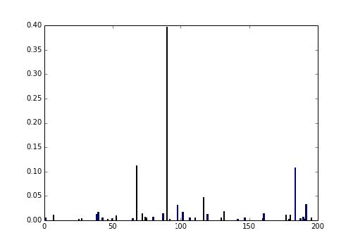
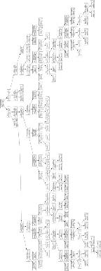
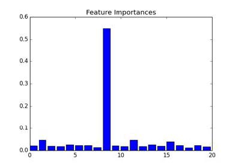

# 第四章 使用 scikit-learn 对数据分类

> 作者：Trent Hauck

> 译者：[飞龙](https://github.com/wizardforcel)

> 协议：[CC BY-NC-SA 4.0](http://creativecommons.org/licenses/by-nc-sa/4.0/)

分类在大量语境下都非常重要。例如，如果我们打算自动化一些决策过程，我们可以利用分类。在我们需要研究诈骗的情况下，有大量的事务，人去检查它们是不实际的。所以，我们可以使用分类都自动化这种决策。

## 4.1 使用决策树实现基本的分类

这个秘籍中，我们使用决策树执行基本的分类。它们是非常不错的模型，因为它们很易于理解，并且一旦训练完成，评估就很容易。通常可以使用 SQL 语句，这意味着结果可以由许多人使用。

## 准备

这个秘籍中，我们会看一看决策树。我喜欢将决策树看做基类，大量的模型从中派生。它是个非常简单的想法，但是适用于大量的情况。

首先，让我们获取一些分类数据，我们可以使用它来练习：

```py
>>> from sklearn import datasets 
>>> X, y = datasets.make_classification(n_samples=1000, n_features=3,
                                        n_redundant=0)
```

### 操作步骤

处理决策树非常简单。我们首先需要导入对象，之后训练模型：

```py

>>> from sklearn.tree import DecisionTreeClassifier 
>>> dt = DecisionTreeClassifier() 
>>> dt.fit(X, y) DecisionTreeClassifier(compute_importances=None, criterion='gini',
                        max_depth=None, max_features=None,
                        max_leaf_nodes=None, min_density=None,
                        min_samples_leaf=1, min_samples_split=2,
                        random_state=None, splitter='best')
>>> preds = dt.predict(X) 
>>> (y == preds).mean() 
1.0
```

你可以看到，我们猜测它是正确的。显然，这只是凑合着运行。现在我们研究一些选项。

首先，如果你观察`dt`对象，它拥有多种关键字参数，决定了对象的行为。我们如何选择对象十分重要，所以我们要详细观察对象的效果。

我们要观察的第一个细节是`max_depth`。这是个重要的参数，决定了允许多少分支。这非常重要，因为决策树需要很长时间来生成样本外的数据，它们带有一些类型的正则化。之后，我们会看到，我们如何使用多种浅层决策树，来生成更好的模型。让我们创建更复杂的数据集并观察当我们允许不同`max_depth`时会发生什么。我们会将这个数据及用于剩下的秘籍。


```py

>>> n_features=200 
>>> X, y = datasets.make_classification(750, n_features,
                                        n_informative=5) 
>>> import numpy as np 
>>> training = np.random.choice([True, False], p=[.75, .25],
                                size=len(y))

>>> accuracies = []

>>> for x in np.arange(1, n_features+1): 
>>> dt = DecisionTreeClassifier(max_depth=x)    
>>> dt.fit(X[training], y[training])    
>>> preds = dt.predict(X[~training])    
>>> accuracies.append((preds == y[~training]).mean())

>>> import matplotlib.pyplot as plt

>>> f, ax = plt.subplots(figsize=(7, 5))

>>> ax.plot(range(1, n_features+1), accuracies, color='k')

>>> ax.set_title("Decision Tree Accuracy") 
>>> ax.set_ylabel("% Correct") 
>>> ax.set_xlabel("Max Depth")

```

输出如下：


我们可以看到，我们实际上在较低最大深度处得到了漂亮的准确率。让我们进一步看看低级别的准确率，首先是 15：

```py
>>> N = 15 
>>> import matplotlib.pyplot as plt 
>>> f, ax = plt.subplots(figsize=(7, 5))
>>> ax.plot(range(1, n_features+1)[:N], accuracies[:N], color='k')
>>> ax.set_title("Decision Tree Accuracy") 
>>> ax.set_ylabel("% Correct") 
>>> ax.set_xlabel("Max Depth")

```

输出如下：


这个就是我们之前看到的峰值。比较令人惊讶的是它很快就下降了。最大深度 1 到 3 可能几乎是相等的。决策树很擅长分离规则，但是需要控制。

我们观察`compute_importances`参数。对于随机森林来说，它实际上拥有更广泛的含义。但是我们要更好地了解它。同样值得注意的是，如果你使用了 0.16 或之前的版本，你可以尽管这样做：

```py

>>> dt_ci = DecisionTreeClassifier(compute_importances=True) 
>>> dt.fit(X, y)
#plot the importances 
>>> ne0 = dt.feature_importances_ != 0

>>> y_comp = dt.feature_importances_[ne0] 
>>> x_comp = np.arange(len(dt.feature_importances_))[ne0]

>>> import matplotlib.pyplot as plt

>>> f, ax = plt.subplots(figsize=(7, 5)) 
>>> ax.bar(x_comp, y_comp)
```

输出如下：



> 要注意，你可能会得到一个错误，让你知道你不再需要显式设置`compute_importances`。

我们看到，这些特征之一非常重要，后面跟着几个其它特征。

### 工作原理

简单来说，我们所有时间都在构造决策树。当思考场景以及将概率分配给结果时，我们构造了决策树。我们的规则更加复杂，并涉及很多上下文，但是使用决策树，我们关心的所有东西都是结果之间的差异，假设特征的一些信息都是已知的。

现在，让我们讨论熵和基尼系数之间的差异。

熵不仅仅是给定变量的熵值，如果我们知道元素的值，它表示了熵中的变化。这叫做信息增益（IG），数学上是这样：

```
IG(Data,KnownFeatures) = H(Data) - H(Data|KnownFeatures)
```

对于基尼系数，我们关心的是，提供新的信息，一个数据点有多可能被错误标记。

熵和基尼系数都有优缺点。也就是说，如果你观察它们工作方式的主要差异，这可能是个重新验证你的假设的好方式。

## 4.2 调整决策树模型

如果我们仅仅使用基本的决策树实现，可能拟合得不是很好。所以我们需要调参，以便获得更好的拟合。这非常简单，并且不用花费什么精力。

### 准备

这个秘籍中，我们深入了解如何调整决策树分类器。有几个渲染，并且在上一个秘籍中，我们仅仅查看了它们之一。

我们会训练一个基本的模型，并实际观察决策树是什么样子。之后，我们会重新检测每个决策，并且指出不同的修改如何影响结构。

如果你打算遵循这个秘籍，需要安装`pydot`。

### 操作步骤

比起其它算法，决策树有许多“把手”，因为我们旋转把手时，易于发现发生了什么。

```py
>>> from sklearn import datasets 
>>> X, y = datasets.make_classification(1000, 20, n_informative=3)
>>> from sklearn.tree import DecisionTreeClassifier 
>>> dt = DecisionTreeClassifier() 
>>> dt.fit(X, y) 
```

好的，所以既然我们训练了基本的分类器，我们可以快速地查看它：

```py
>>> from StringIO import StringIO
>>> from sklearn import tree 
>>> import pydot
>>> str_buffer = StringIO() 
>>> tree.export_graphviz(dt, out_file=str_buffer) 
>>> graph = pydot.graph_from_dot_data(str_buffer.getvalue()) 
>>> graph.write("myfile.jpg")
```

这张图几乎难以辨认，但是这展示了一颗复杂的树，它可以使用非最优的决策树，作为结果生成。



哇哦！这是个非常复杂的树，看上去对数据过拟合了。首先，让我们降低最大深度值：

```py
>>> dt = DecisionTreeClassifier(max_depth=5) 
>>> dt.fit(X, y); 
```

顺带一说，如果你想知道为什么能看到分号，通常是`repr`，它实际上是决策树的模型。例如`fit`函数实际上返回决策树对象，它允许链式调用：

```py
>>> dt = DecisionTreeClassifier(max_depth=5).fit(X, y) 
```

现在，让我们返回正常的程序。

由于我们会多次绘制它，我们创建一个函数。


```py
>>> def plot_dt(model, filename):
       str_buffer = StringIO() 
>>> tree.export_graphviz(model, out_file=str_buffer)    
>>> graph = pydot.graph_from_dot_data(str_buffer.getvalue()) 
>>> graph.write_jpg(filename)
>>> plot_dt(dt, "myfile.png")

```

会生成下面的图：


这棵树稍微简单了一些。让我们看看，如果我们将熵用作分割标准，会发生什么：

```py
>>> dt = DecisionTreeClassifier(criterion='entropy',
                                 max_depth=5).fit(X, y) 
>>> plot(dt, "entropy.png") 
```

会生成下面的图：


很容易看到，前两个分割是相同特征，之后的分割以相似总数分布。这是个良好的合理的检查。

同样，注意第一个分割的熵是 0.999，但是使用基尼系数的时候是 0.5。我们需要弄清楚，决策树的分割的两种度量有什么不同。更多信息请见下面的工作原理一节。但是，如果我们想要使用熵穿件决策树，我们必须使用下列命令：

```py
>>> dt = DecisionTreeClassifier(min_samples_leaf=10,
                                criterion='entropy',
                                max_depth=5).fit(X, y)

```

### 工作原理

决策树，通常容易出现过拟合。由于它的自身特性，决策树经常会过拟合，所以，我们需要思考，如何避免过拟合，这是为了避免复杂性。实战中，简单的模型通常会执行得更好。

我们即将在实战中看到这个理念。随机森林会在简单模型的理念上构建。

## 4.3 使用许多决策树 -- 随机森林

这个秘籍中，我们会将随机森林用于分类任务。由于随机森林对于过拟合非常健壮，并且在大量场景中表现良好，所以使用它。

### 准备

我们会在工作原理一节中深入探索，但是随即森林通过构造大量浅层树，之后让每颗树为分类投票，再选取投票结果。这个想法在机器学习中十分有效。如果我们发现简单训练的分类器只有 60% 的准确率，我们可以训练大量分类器，它们通常是正确的，并且随后一起使用它们。

### 操作步骤

训练随机森林分类器的机制在 Scikit 中十分容易。这一节中，我们执行以下步骤：


1.  创建用于练习的样例数据集

2.  训练基本的随机森林对象

3.  看一看训练对象的一些属性

下一个秘籍中，我们会观察如何调整随机森林分类器，让我们以导入数据集来开始：

```py
>>> from sklearn import datasets 
```

之后，使用 1000 个样例创建数据集：

```py
>>> X, y = datasets.make_classification(1000) 
```

既然我们拥有了数据，我们可以创建分类器对象并训练它：

```py
>>> from sklearn.ensemble import RandomForestClassifier
>>> rf = RandomForestClassifier()
>>> rf.fit(X, y) 
```

我们想做的第一件事，就是看看如何拟合训练数据。我们可以将`predict `方法用于这些东西：

```py
>>> print "Accuracy:\t", (y == rf.predict(X)).mean() 
Accuracy:   0.993
>>> print "Total Correct:\t", (y == rf.predict(X)).sum() Total 
Correct:   993 
```

现在，让我们查看一些属性和犯法。

首先，我们查看一些实用属性。这里，由于我们保留默认值，它们是对象的默认值：

+   `rf.criterion`：这是决定分割的标准。默认是`gini`。

+   `rf.bootstrap`：布尔值，表示在训练随机森林时是否使用启动样例

+   `rf.n_jobs`：训练和预测的任务数量。如果你打算使用所有处理器，将其设置为`-1`。要记住，如果你的数据集不是非常大，使用过多任务通常会导致浪费，因为处理器之间需要序列化和移动。

+   `rf.max_features`：这表示执行最优分割时，考虑的特征数量。在调参过程中这会非常方便。

+   `rf.conpute_importtances`：这有助于我们决定，是否计算特征的重要性。如何使用它的信息，请见更多一节。

+   `rf.max_depth`：这表示树的深度。

有许多属性需要注意，更多信息请查看官方文档。

不仅仅是`predect`方法很实用，我们也可以从独立的样子获取概率。这是个非常实用的特性，用于理解每个预测的不确定性。例如，我们可以预测每个样例对于不同类的概率。

```py
>>> probs = rf.predict_proba(X)
>>> import pandas as pd
>>> probs_df = pd.DataFrame(probs, columns=['0', '1']) >>> probs_df['was_correct'] = rf.predict(X) == y
>>> import matplotlib.pyplot as plt
>>> f, ax = plt.subplots(figsize=(7, 5))
>>> probs_df.groupby('0').was_correct.mean().plot(kind='bar', ax=ax) 
>>> ax.set_title("Accuracy at 0 class probability")
>>> ax.set_ylabel("% Correct") 
>>> ax.set_xlabel("% trees for 0") 
```


### 工作原理

随机森轮实用预定义数量的弱决策树，并且使用数据的自己训练每一颗树。这对于避免过拟合至关重要。这也是`bootstrap`参数的原因。我们的每个树拥有下列东西：

+   票数最多的类

+   输出，如果我们使用回归树

当然，它们是表现上的考量，这会在下一个秘籍中设计。但是出于礼节随机森林如何工作的目的，我们训练一些平均数，作为结果，获得了非常好的分类器。

### 更多

特征重要性是随机森林的不错的副产品。这通常有助于回答一个问题：如果我们拥有 10 个特征，对于判断数据点的真实类别，哪个特征是最重要的？真实世界中的应用都易于观察。例如，如果一个事务是不真实的，我们可能想要了解，是否有特定的信号，可以用于更快弄清楚事务的类别。

如果我们打算极端特征重要性，我们需要在我们创建对象时说明。如果你使用 scikit-learn 0.15，你可能会得到一个警告，说这不是必需的。在 0.16 中，警告会被移除。

```py
>>> rf = RandomForestClassifier(compute_importances=True) 
>>> rf.fit(X, y) 
>>> f, ax = plt.subplots(figsize=(7, 5)) 
>>> ax.bar(range(len(rf.feature_importances_)),            rf.feature_importances_) 
>>> ax.set_title("Feature Importances")

```

下面就是输出：



我们可以看到，在判断结果是类 0 或者 1 时，特定的特征比其它特征重要。
