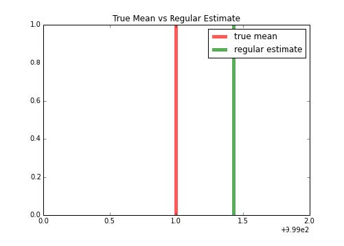
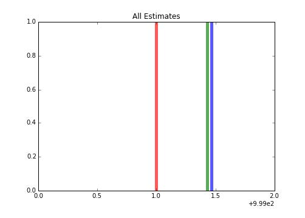

# 第五章 模型后处理

> 作者：Trent Hauck

> 译者：[飞龙](https://github.com/wizardforcel)

> 协议：[CC BY-NC-SA 4.0](http://creativecommons.org/licenses/by-nc-sa/4.0/)

## 5.1 K-fold 交叉验证

这个秘籍中，我们会创建交叉验证，它可能是最重要的模型后处理验证练习。我们会在这个秘籍中讨论 k-fold 交叉验证。有几种交叉验证的种类，每个都有不同的随机化模式。K-fold 可能是一种最熟知的随机化模式。

### 准备

我们会创建一些数据集，之后在不同的在不同的折叠上面训练分类器。值得注意的是，如果你可以保留一部分数据，那是最好的。例如，我们拥有`N = 1000`的数据集，如果我们保留 200 个数据点，之后使用其他 800 个数据点之间的交叉验证，来判断最佳参数。

### 工作原理

首先，我们会创建一些伪造数据，之后测试参数，最后，我们会看看结果数据集的大小。

```py
>>> N = 1000  
>>> holdout = 200
>>> from sklearn.datasets import make_regression 
>>> X, y = make_regression(1000, shuffle=True) 
```

既然我们拥有了数据，让我们保留 200 个点，之后处理折叠模式。


```py
>>> X_h, y_h = X[:holdout], y[:holdout] 
>>> X_t, y_t = X[holdout:], y[holdout:]
>>> from sklearn.cross_validation import KFold 
```

K-fold 给了我们一些选项，来选择我们想要多少个折叠，是否让值为下标或者布尔值，是否打算打乱数据集，最后是随机状态（主要出于再现性）。下标实际上会在之后的版本中溢出。假设它为`True`。

让我们创建交叉验证对象：


```py
>>> kfold = KFold(len(y_t), n_folds=4) 
```

现在，我们可以迭代 k-fold 对象：

```py
>>> output_string = "Fold: {}, N_train: {}, N_test: {}"

>>> for i, (train, test) in enumerate(kfold):
        print output_string.format(i, len(y_t[train]), len(y_t[test]))
        
Fold: 0, N_train: 600, N_test: 200 
Fold: 1, N_train: 600, N_test: 200 
Fold: 2, N_train: 600, N_test: 200 
Fold: 3, N_train: 600, N_test: 200
```

每个迭代都应该返回相同的分割大小。

### 工作原理

可能很清楚，但是 k-fold 的原理是迭代折叠，并保留` 1/n_folds * N`个数据，其中`N`是我们的`len(y_t)`。

从 Python 的角度看，交叉验证对象拥有一个迭代器，可以通过`in`运算符来访问。通常，对于编写交叉验证对象的包装器来说比较实用，它会迭代数据的子集。例如我们可能拥有一个数据集，它拥有数据点的重复度量，或者我们可能拥有一个病人的数据集，每个病人都拥有度量。

我们打算将它们组合起来，并对其使用 Pandas。

```py
>>> import numpy as np 
>>> import pandas as pd

>>> patients = np.repeat(np.arange(0, 100, dtype=np.int8), 8)

>>> measurements = pd.DataFrame({'patient_id': patients,
                   'ys': np.random.normal(0, 1, 800)}) 
```
既然我们拥有了数据，我们仅仅打算保留特定的顾客，而不是数据点。

```
>>> custids = np.unique(measurements.patient_id) 
>>> customer_kfold = KFold(custids.size, n_folds=4)

>>> output_string = "Fold: {}, N_train: {}, N_test: {}"

>>> for i, (train, test) in enumerate(customer_kfold):
        train_cust_ids = custids[train]
        training = measurements[measurements.patient_id.isin(
                   train_cust_ids)]
        testing = measurements[~measurements.patient_id.isin(
                   train_cust_ids)]

        print output_string.format(i, len(training), len(testing))

Fold: 0, N_train: 600, N_test: 200 
Fold: 1, N_train: 600, N_test: 200 
Fold: 2, N_train: 600, N_test: 200 
Fold: 3, N_train: 600, N_test: 200 
```

## 5.2 自动化交叉验证

我们会查看如何使用 Sklearn 自带的交叉验证，但是我们也可以使用一个辅助函数，来自动化执行交叉验证。这类似于 Sklearn 中其它对象，如何被辅助函数和流水线包装。

### 准备

首先，我们需要创建样例分类器，它可以是任何东西，决策树、随机森林，以及其他。对我们来说，它是随机森林。我们之后会创建数据集，并使用交叉验证函数。

### 工作原理

首先导入`ensemble `模块来开始：

```py
>>> from sklearn import ensemble 
>>> rf = ensemble.RandomForestRegressor(max_features='auto')
```

好的，所以现在，让我们创建一些回归数据：

```py
>>> from sklearn import datasets 
>>> X, y = datasets.make_regression(10000, 10)
```

既然我们拥有了数据，我们可以导入`cross_validation`模块，并获取我们将要使用的函数：

```py
>>> from sklearn import cross_validation

>>> scores = cross_validation.cross_val_score(rf, X, y)

>>> print scores
[ 0.86823874  0.86763225  0.86986129]
```

## 工作原理

很大程度上，它会委托给交叉验证对象。一个不错的事情是，函数会并行处理交叉验证。

我们可开启详细模式：

```py
>>> scores = cross_validation.cross_val_score(rf, X, y, verbose=3,
             cv=4)
             
[CV] no parameters to be set 
[CV] no parameters to be set, score=0.872866 -   0.7s 
[CV] no parameters to be set 
[CV] no parameters to be set, score=0.873679 -   0.6s 
[CV] no parameters to be set 
[CV] no parameters to be set, score=0.878018 -   0.7s 
[CV] no parameters to be set 
[CV] no parameters to be set, score=0.871598 -   0.6s

[Parallel(n_jobs=1)]: Done   1 jobs       | elapsed:    0.7s 
[Parallel(n_jobs=1)]: Done   4 out of   4 | elapsed:    2.6s finished 
```

我们可以看到，在每次迭代中，我们都调用函数来获得得分。我们也知道了模型如何运行。

同样值得了解是的，我们可以对我们尝试拟合的模型，获取预测得分。我们也会讨论如何创建你自己的评分函数。

## 5.3 使用 ShuffleSplit 交叉验证

`ShuffleSplit`是最简单的交叉验证技巧之一。这个交叉验证技巧只是将数据的样本用于指定的迭代数量。

### 准备

`ShuffleSplit`是另一个简单的交叉验证技巧。我们会指定数据集中的总元素，并且它会考虑剩余部分。我们会浏览一个例子，估计单变量数据集的均值。这有点类似于重采样，但是它说明了一个原因，为什么我们在展示交叉验证的时候使用交叉验证。

### 操作步骤

首先，我们需要创建数据集。我们使用 NumPy 来创建数据集，其中我们知道底层的均值。我们会对半个数据集采样，来估计均值，并看看它和底层的均值有多接近。

```py
>>> import numpy as np

>>> true_loc = 1000 
>>> true_scale = 10 
>>> N = 1000

>>> dataset = np.random.normal(true_loc, true_scale, N)

>>> import matplotlib.pyplot as plt

>>> f, ax = plt.subplots(figsize=(7, 5))

>>> ax.hist(dataset, color='k', alpha=.65, histtype='stepfilled'); 
>>> ax.set_title("Histogram of dataset");

>>> f.savefig("978-1-78398-948-5_06_06.png") 
```

NumPy 输出如下：


现在，让我们截取前一半数据集，并猜测均值：

```py
>>> from sklearn import cross_validation

>>> holdout_set = dataset[:500] 
>>> fitting_set = dataset[500:]

>>> estimate = fitting_set[:N/2].mean()

>>> import matplotlib.pyplot as plt

>>> f, ax = plt.subplots(figsize=(7, 5))

>>> ax.set_title("True Mean vs Regular Estimate")

>>> ax.vlines(true_loc, 0, 1, color='r', linestyles='-', lw=5,
              alpha=.65, label='true mean') 
>>> ax.vlines(estimate, 0, 1, color='g', linestyles='-', lw=5,
              alpha=.65, label='regular estimate')

>>> ax.set_xlim(999, 1001)

>>> ax.legend()

>>> f.savefig("978-1-78398-948-5_06_07.png") 
```

输出如下：



现在，我们可以使用`ShuffleSplit `在多个相似的数据集上拟合估计值。

```py

>>> from sklearn.cross_validation import ShuffleSplit

>>> shuffle_split = ShuffleSplit(len(fitting_set))

>>> mean_p = []

>>> for train, _ in shuffle_split:
        mean_p.append(fitting_set[train].mean())
        shuf_estimate = np.mean(mean_p)

>>> import matplotlib.pyplot as plt

>>> f, ax = plt.subplots(figsize=(7, 5))

>>> ax.vlines(true_loc, 0, 1, color='r', linestyles='-', lw=5,
              alpha=.65, label='true mean') 
>>> ax.vlines(estimate, 0, 1, color='g', linestyles='-', lw=5,
              alpha=.65, label='regular estimate') 
>>> ax.vlines(shuf_estimate, 0, 1, color='b', linestyles='-', lw=5,
              alpha=.65, label='shufflesplit estimate')

>>> ax.set_title("All Estimates") 
>>> ax.set_xlim(999, 1001)

>>> ax.legend(loc=3)
```

输出如下：



我们可以看到，我们得到了类似于预期的估计值，但是我们可能使用多个样本来获取该值。

## 5.4 分层的 k-fold

这个秘籍中，我们会快速查看分层的 k-fold 估值。我们会浏览不同的秘籍，其中分类的表示在某种程度上是不平衡的。分层的 k-fold 非常不错，因为他的模式特地为维持分类的比例而设计。

### 准备

我们打算创建一个小型的数据集。这个数据集中，我们随后会使用分层的 k-fold 验证。我们想让它尽可能小，以便我们查看变化。对于更大的样本，可能并不是特别好。

我们之后会绘制每一步的分类比例，来展示如何维护分类比例。

```py
>>> from sklearn import datasets 
>>> X, y = datasets.make_classification(n_samples=int(1e3),
           weights=[1./11])

```

让我们检查分类的总体权重分布：

```py
>>> y.mean()
0.90300000000000002
```

90.5% 的样本都是 1，其余为 0。

### 操作步骤

让我们创建分层 k-fold 对象，并通过每个折叠来迭代。我们会度量为 1 的`verse `比例。之后，我们会通过分割数字来绘制分类比例，来看看是否以及如何发生变化。这个代码展示了为什么它非常好。我们也会对基本的`ShuffleSplit`绘制这个代码。

```py
>>> from sklearn import cross_validation

>>> n_folds = 50

>>> strat_kfold = cross_validation.StratifiedKFold(y,
                  n_folds=n_folds) 
>>> shuff_split = cross_validation.ShuffleSplit(n=len(y),
                  n_iter=n_folds)

>>> kfold_y_props = [] 
>>> shuff_y_props = []

>>> for (k_train, k_test), (s_train, s_test) in zip(strat_kfold,  
>>> shuff_split):         
        kfold_y_props.append(y[k_train].mean())       
        shuff_y_props.append(y[s_train].mean()) 
```

现在，让我们绘制每个折叠上的比例：

```py

>>> import matplotlib.pyplot as plt

>>> f, ax = plt.subplots(figsize=(7, 5))

>>> ax.plot(range(n_folds), shuff_y_props, label="ShuffleSplit",
            color='k') 
>>> ax.plot(range(n_folds), kfold_y_props, label="Stratified",
            color='k', ls='--') 
>>> ax.set_title("Comparing class proportions.")

>>> ax.legend(loc='best')

```

输出如下：


我们可以看到，分层的 k-fold 的每个折叠的比例，在每个折叠之间是稳定的。

### 工作原理

分层 k-fold 的原理是选取`y`值。首先，获取所有分类的比例，之后将训练集和测试集按比例划分。这可以推广到多个标签：

```py

>>> import numpy as np

>>> three_classes = np.random.choice([1,2,3], p=[.1, .4, .5],
                    size=1000)

>>> import itertools as it

>>> for train, test in cross_validation.StratifiedKFold(three_classes, 5):
        print np.bincount(three_classes[train])
        
[  0  90 314 395] 
[  0  90 314 395]
[  0  90 314 395] 
[  0  91 315 395] 
[  0  91 315 396]
```

我们可以看到，我们得到了每个分类的样例大小，正好是训练集合测试集的比例。
